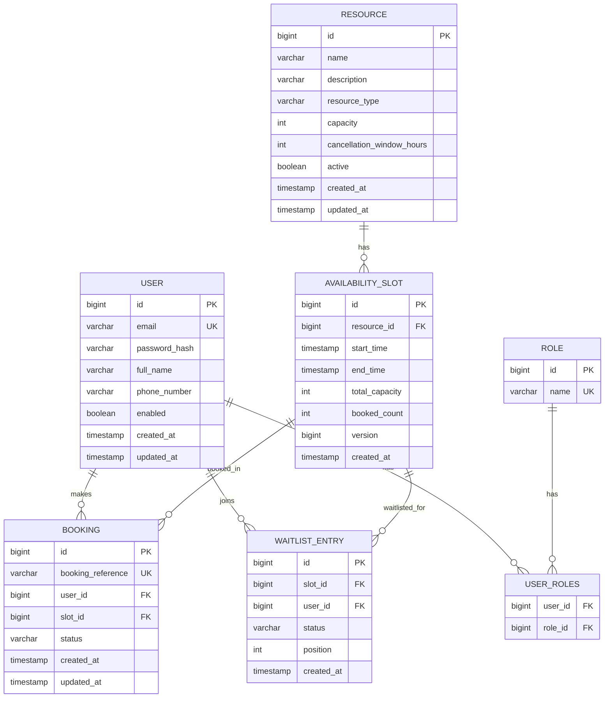
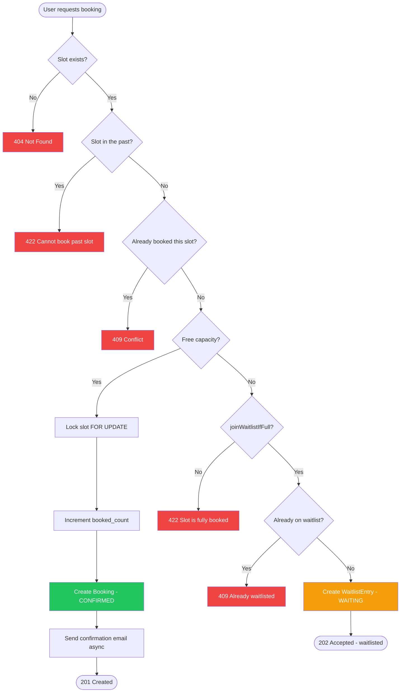
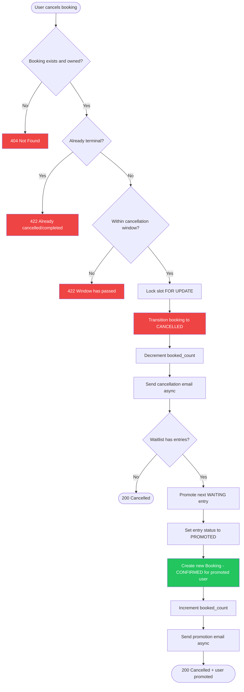
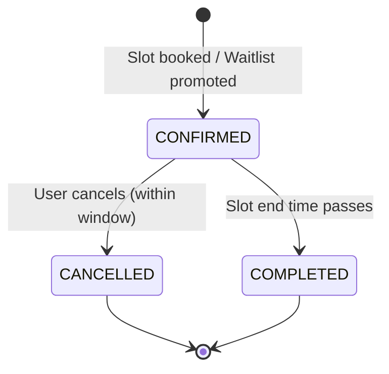

# AmenityHub Backend

A community amenity/resource booking backend. Residents reserve shared building
resources (gym, party hall, EV charger, parking, co-working rooms). The service
focuses on the interesting parts of a booking system: **concurrency-safe
reservations, a booking state machine, and a waitlist with auto-promotion**.

## Tech stack

- Java 21, Spring Boot 3.3
- Spring Web, Spring Data JPA, Spring Security 6 (stateless JWT)
- PostgreSQL 16 (schema managed by Hibernate `ddl-auto`)
- Thymeleaf + Spring Mail for HTML notifications (async)
- Gradle build, Docker Compose for local infra

## Architecture

### Project structure

Each feature follows a layered sub-package layout: `controller`, `service`,
`repository`, `entity`, and `dto`.

```
com.amenityhub
├── auth/           # JWT issuing/validation, register/login, security filter
│   ├── controller
│   ├── service
│   ├── entity
│   └── dto
├── user/           # User + Role entities, repositories, role seeder
│   ├── entity
│   ├── repository
│   └── service
├── resource/       # Resource + AvailabilitySlot, availability queries, admin CRUD
│   ├── controller
│   ├── service
│   ├── repository
│   ├── entity
│   └── dto
├── booking/        # Booking state machine, concurrency-safe booking
│   ├── controller
│   ├── service
│   ├── repository
│   ├── entity
│   └── dto
├── waitlist/       # WaitlistEntry + status
│   ├── entity
│   └── repository
├── notification/   # Async HTML email sender
│   └── service
├── common/         # Exceptions + RFC 7807 error handler
│   └── exception
└── config/         # Security, JWT props, async executor
```

### Architecture diagram

> Rendered SVG: [`docs/diagrams/architecture.svg`](docs/diagrams/architecture.svg)



```mermaid
graph TB
    subgraph Client
        A[REST Client / Frontend]
    end

    subgraph Spring Boot Application
        subgraph Security Layer
            F1[JwtAuthenticationFilter]
            F2[SecurityConfig]
            F3[RestAuthenticationEntryPoint]
        end

        subgraph Controllers
            C1[AuthController]
            C2[ResourceController]
            C3[BookingController]
        end

        subgraph Services
            S1[AuthService]
            S2[JwtService]
            S3[CurrentUserService]
            S4[ResourceService]
            S5[BookingService]
            S6[BookingEmailSender]
        end

        subgraph Repositories
            R1[UserRepository]
            R2[RoleRepository]
            R3[ResourceRepository]
            R4[AvailabilitySlotRepository]
            R5[BookingRepository]
            R6[WaitlistEntryRepository]
        end
    end

    subgraph Infrastructure
        DB[(PostgreSQL)]
        MAIL[Mailpit / SMTP]
    end

    A -->|HTTP + JWT| F1
    F1 --> F2
    F2 --> C1 & C2 & C3

    C1 --> S1
    S1 --> S2
    S1 --> R1 & R2
    C2 --> S4
    S4 --> R3 & R4
    C3 --> S5
    S5 --> S3
    S5 --> R5 & R4 & R6
    S5 -->|@Async| S6

    R1 & R2 & R3 & R4 & R5 & R6 --> DB
    S6 --> MAIL
```

### Entity relationship diagram

> Rendered SVG: [`docs/diagrams/entity-relationship.svg`](docs/diagrams/entity-relationship.svg)





### Booking flow diagram

> Rendered SVG: [`docs/diagrams/booking-flow.svg`](docs/diagrams/booking-flow.svg)





### Cancellation and waitlist promotion flow

> Rendered SVG: [`docs/diagrams/cancellation-flow.svg`](docs/diagrams/cancellation-flow.svg)





### Booking state machine

> Rendered SVG: [`docs/diagrams/booking-state-machine.svg`](docs/diagrams/booking-state-machine.svg)





### Design highlights

- **Concurrency**: booking loads the slot with a pessimistic write lock
  (`SELECT ... FOR UPDATE`) so two residents cannot over-book the last spot.
  Slots also carry an optimistic `@Version` column as a second guard.
- **State machine**: bookings move `CONFIRMED → CANCELLED | COMPLETED`; illegal
  transitions are rejected in the domain entity.
- **Waitlist auto-promotion**: cancelling a booking frees a seat and promotes the
  next waiting resident in the same transaction.
- **Notifications**: booking emails are sent asynchronously (`@Async`), so mail
  latency never affects the API call.
- **Errors**: all failures return RFC 7807 `application/problem+json`.

## Running locally

### Prerequisites
- Java 21
- Docker (for PostgreSQL + Mailpit)

### Default accounts (seeded on startup)

| Email                      | Password      | Role         |
|----------------------------|---------------|--------------|
| `admin@amenityhub.local`   | `admin1234`   | ROLE_ADMIN   |
| `manager@amenityhub.local` | `manager1234` | ROLE_MANAGER |

### 1. Start infrastructure

```bash
docker compose up -d
```

This starts PostgreSQL on `5433` and Mailpit (SMTP capture) with a web UI at
http://localhost:8025.

### 2. Run the app

```bash
./gradlew bootRun
```

Hibernate creates/updates the schema on startup and the baseline roles + staff
accounts are seeded automatically. The API is available at
http://localhost:9099.

### 3. Build

```bash
./gradlew build
```

## API overview

| Method | Path                                        | Auth            |
|--------|---------------------------------------------|-----------------|
| POST   | `/api/v1/auth/register`                     | public          |
| POST   | `/api/v1/auth/login`                        | public          |
| GET    | `/api/v1/resources`                         | public          |
| GET    | `/api/v1/resources/{id}`                    | public          |
| GET    | `/api/v1/resources/{id}/availability?date=` | public          |
| POST   | `/api/v1/resources`                         | MANAGER / ADMIN |
| POST   | `/api/v1/resources/{id}/slots`              | MANAGER / ADMIN |
| POST   | `/api/v1/bookings`                          | authenticated   |
| GET    | `/api/v1/bookings`                          | authenticated   |
| GET    | `/api/v1/bookings/{reference}`              | authenticated   |
| DELETE | `/api/v1/bookings/{bookingId}`              | authenticated   |

### Example flow

```bash
# Login as manager (seeded account)
curl -X POST http://localhost:9099/api/v1/auth/login \
  -H 'Content-Type: application/json' \
  -d '{"email":"manager@amenityhub.local","password":"manager1234"}'

# Create a resource (requires MANAGER or ADMIN role)
curl -X POST http://localhost:9099/api/v1/resources \
  -H "Authorization: Bearer <ACCESS_TOKEN>" \
  -H 'Content-Type: application/json' \
  -d '{"name":"Community Gym","resourceType":"GYM","capacity":1,"cancellationWindowHours":2}'

# Register a resident
curl -X POST http://localhost:9099/api/v1/auth/register \
  -H 'Content-Type: application/json' \
  -d '{"email":"resident@example.com","password":"password123","fullName":"Resident One"}'

# Book a slot
curl -X POST http://localhost:9099/api/v1/bookings \
  -H "Authorization: Bearer <ACCESS_TOKEN>" \
  -H 'Content-Type: application/json' \
  -d '{"slotId": 1, "joinWaitlistIfFull": true}'
```

## Configuration

Key environment variables:

| Variable            | Default                                       | Description                |
|---------------------|-----------------------------------------------|----------------------------|
| `DB_URL`            | `jdbc:postgresql://localhost:5433/amenityhub`  | JDBC URL                   |
| `DB_USERNAME`       | `amenityhub`                                  | DB user                    |
| `DB_PASSWORD`       | `amenityhub`                                  | DB password                |
| `SERVER_PORT`       | `9099`                                        | Application port           |
| `APP_JWT_SECRET`    | dev-only base64 secret                        | HS256 signing key (base64) |
| `MAIL_HOST`         | `localhost`                                   | SMTP host (Mailpit locally)|
| `MAIL_PORT`         | `1025`                                        | SMTP port                  |

## Roles

Seeded on startup: `ROLE_RESIDENT` (default on registration), `ROLE_MANAGER`,
`ROLE_ADMIN`. Manager/Admin can create resources and availability slots.